---
title: <p class="title">Analyse de réseaux</p><hr class="lign"><p class="title2">Mesures et représentations avec le langage/logiciel R</p>
author: Hugues Pecout (CNRS, FR CIST) </br> Laurent Beauguitte (CNRS, UMR Géographie-cités) <br>
date:  Initiation à l’analyse de réseaux en SHS </br> Nice, du 1 au 6 juillet 2019
css: gdrar.css
output:
  rmdformats::readthedown:
    self_contained: true
    thumbnails: false
    lightbox: true
    gallery: true
    highlight: tango
--- 

```{r klippy, echo=FALSE, include=TRUE}
# devtools::install_github("RLesur/klippy")
# klippy::klippy()

options("scipen" = 10)
```


<br/>

>Ce document est un **cours d'introduction à l'analyse de réseaux avec R**.      
Il s'agit du support de cours utilisé pour l'atelier "mesures et représentations" réalisé dans le cadre de l'[**École d'été : Initiation à l’analyse de réseaux en SHS**](https://arshs.hypotheses.org/1200){target="_blank"}, organisé par le [**GDR « Analyse de réseaux en sciences humaines et sociales »**](https://arshs.hypotheses.org/){target="_blank"} à Nice du 1 au 6 Juillet 2019, au Centre de la Méditerranée Moderne et Contemporaine.
> 
> --- H. Pecout (CNRS, FR CIST), L. Beauguitte (CNRS, UMR Géographie-cités)

<br/>

# Introduction à R et Rstudio

Toutes les disciplines dans lesquelles l’analyse de données occupe une place importante ont connu ces dernières années une petite révolution. Depuis le début des années 2000, le logiciel/langage R gagne en importance et s'impose petit à petit comme une référence, au même titre que les trois grands logiciels (payants) d’analyse de données qui dominent le marché : SAS, SPSS et Stata.


## Un logiciel pour tout f'R


<ul>
<li>Libre et multiplateforme</li> 

**R est un langage de programmation et un logiciel libre** dédié aux statistiques et au traitement/gestion de données et soutenu par la R Foundation for Statistical Computing. **R fait partie de la liste des paquets GNU.  Il est multiplate-forme** et peut ainsi être utilisé sur Windows, Mac OS ou GNU/Linux.

<br/>

<li>Extensible</li> 

```{r warning=FALSE, message=FALSE, eval=TRUE, include= TRUE, echo=FALSE}

library('rvest')
url <- "https://cran.r-project.org/web/packages/available_packages_by_date.html"
#Reading the HTML code from the website
webpage <- read_html(url)
td <- webpage %>%  html_nodes("td")
rank_data <- html_text(td)

vec <- c(NULL)
for (t in seq(1,length(rank_data),3))  {
vec <-  c(vec, rank_data[t])
}

library(stringr)
vec <- str_trim(vec)
test <- as.data.frame(vec)
test$nb <- 1
test$date <- as.Date(test$vec)
test <- test[,c(3:2)]

library(plyr)
test2 <-  ddply(test, .(date), summarize, nb=sum(nb))
test2$cum <- cumsum(test2$nb)
test <- test2[,c(1:3)]

nb_function_base <- length(lsf.str("package:base"))

```

R est composé d’un socle commun, le <span style="color:#4B0082">r-base</span> (ensemble de fonctions statistiques et graphiques standards, appelées fonctions primitives ou basiques), sur lequel se greffe un ensemble d'extensions appelées <span style="color:#4B0082">packages</span>. **Un package est une bibliothèque de fonctions implémentée par un utilisateur.trice  et mise à disposition de tou.te.s** par l’intermédiaire de dépôts regroupés dans le cadre du Comprehensive R Archive Network (CRAN). Cette structure modulaire permet d'étendre les applications possibles : **l’expansion du logiciel n’est limitée que par les contributions des utilisateurs.trices** du monde entier à la communauté (le `r format(Sys.time(), '%d %b %Y')`, `r max(test2$cum)` packages étaient disponibles sur le CRAN).

<br/>

```{r warning=FALSE, message=FALSE, eval=TRUE, include= TRUE, echo=FALSE}

library(ggplot2)
ggplot(test2, aes(date,cum)) + geom_line(lwd=1, col='#0162b1') + xlab("") + ylab("") +
 scale_x_date(date_minor_breaks = "1 month", date_labels = "%Y", 
 breaks =  as.Date(c('2005-01-01', '2006-01-01', '2007-01-01', '2008-01-01', '2009-01-01', '2010-01-01', '2011-01-01','2012-01-01','2013-01-01', '2014-01-01','2015-01-01', '2016-01-01', '2017-01-01', '2018-01-01', '2019-01-01'))) +
 ggtitle("Nombre de packages disponibles sur le CRAN") +
 theme(plot.title = element_text(hjust = 0, size=11,face = "bold" )) + 
 annotate(geom="text", x=as.Date('2017-01-01'), y=12900, label=paste0(max(test2$cum), ' packages disponibles \n (le ' , format(Sys.time(), '%d %b %Y'), ")"), color="red4", size =3) +
 geom_point(aes(x=max(test2$date), y=max(test2$cum)), color="red4")

object_test <<- "test"

```

<br/>

<li>Polyvalent</li> 

La communauté grandissante d'utilisateurs.trices et de contributeurs.trices R se traduit par une polyvalence remarquable de l'outil. C'est pour cette raison qu’il concurrence, complète ou remplace toute une gamme de logiciels et de langages pré-existants y compris dans des domaines très spécifiques, par exemple : **la statistique textuelle, l'analyse de graphes, la cartographie, la statistique spatiale, le traitement d'enquête, le webscraping, la production de document, les applications web...**. 

<br/>

<p class="center">


**R se substitue ainsi à tout un ensemble de logiciels**. Il permet de réaliser une chaîne de traitement de données complète (de la collecte à la valorisation) et ainsi d'avoir **l'ensemble de son flux de travail au sein d'un seul logiciel**.


<br/>

<li>Reproductible</li> 

**L'ensemble d'une chaîne de traitement peut ainsi être réalisé sous R**, depuis l'import, la manipulation de données, leur analyse et représentation, jusqu'à leur diffusion. Ce flux de travail intégré permet de se soustraire des imports et exports fréquents (afin de passer d'un logiciel à un autre) et minimise les erreurs de manipulation.  
Écrire la globalité de la chaîne de traitement réalisée dans un script R ré-exécutable assure **l'archivage, la diffusion et la reproductibilité de l'intégralité de son travail et de sa méthodologie**.     


<br/>

**Ces différents atouts ont fait de R un outil adopté par de nombreuses disciplines scientifiques, aussi bien issues des SHS que des sciences dites dures. R dispose aujourd'hui de nombreux contributeurs.trices aux profils et intérêts variés, ce qui lui assure un développement fonctionnel et thématique à la fois large et spécialisé**.   


<br/>


## L'environnement RStudio

**RStudio est un outil qui vient combler un manque dans la collection des outils associés à R** : il s’agit d’un environnement de développement intégré (IDE en anglais) facilitant l'utilisation de R (saisie, exécution de code, visualisation des résultats, etc.) 

Le logiciel R propose une interface minimaliste sur MAC et Windows et inexistante sous linux.

<p class="center">
</p>
<p class="center"> Figure : Interface du logiciel R, sous Windows</p>

L'IDE Rstudio facilite considérablement l'apprentissage et l'utilisation du langage R. **Parce que c’est pratique, complet et en rapide évolution, il est recommandé d’utiliser l’environnement RStudio.**


<br/>

## Installation R et RStudio

### Installer R

Vous pouvez télécharger le logiciel R depuis le <a href="https://cran.r-project.org/" onclick="window.open(this.href); return false;">**Comprehensive R Archive Network (CRAN)**</a> :

<p class="center">
</p>

Pour mettre à jour R, il suffit de télécharger et d’installer la dernière version du programme d’installation.  
**Attention, la nouvelle version sera installée à côté de l’ancienne version**. Désinstallez l’ancienne version si vous souhaitez faire de la place sur votre disque dur.

<br/>

### Installer Rstudio

Une fois R correctement installé, rendez-vous sur le site web <a href="https://www.rstudio.com/products/rstudio/download/" onclick="window.open(this.href); return false;">**Rstudio**</a> pour télécharger la dernière version stable et gratuite de RStudio. Il s’agit de l’édition Open Source de **RStudio Desktop**.

<p class="center">
</p>

Choisissez l’installateur correspondant à votre système d’exploitation et suivez les instructions du programme d’installation.

**Lorsque plusieurs versions de R sont disponibles, RStudio choisit par défaut la plus récente**. Il est vous est possible de spécifier à RStudio quelle version de R utiliser via le menu Tools > Global Options > General.

**Il est inutile de lancer R lorsque l'on utilise l'interface RStudio. Celui-ci est automatiquement démarré lors de l'ouverture de l'IDE**.


<br/>


## Présentation de RStudio

### L'interface Rstudio

**L'interface de RStudio se présente sous la forme d’une fenêtre découpée en quatre zones** que l’on peut redimensionner, masquer ou maximiser selon ses préférences :

<li>L’éditeur de code</li> 
Cette zone permet l’édition de fichiers source R (avec coloration syntaxique et auto complétion).

<li>La console</li>
La console avec la session R en cours d’exécution. La console affiche à la fois le code exécuté, ses résultats associés, ainsi que les avertissements (warnings) et messages d'erreur éventuels (errors). 

<li>L’espace de travail</li>
Cette zone permet de lister, typer et visualiser les objets créés par l'exécution du code R.

<li> Une quatrième zone permettant de basculer entre :</li>
Un explorateur de fichiers, une fenêtre graphique, une fenêtre de gestion des packages et de la documentation associée aux fonctions et packages.


<p class="center">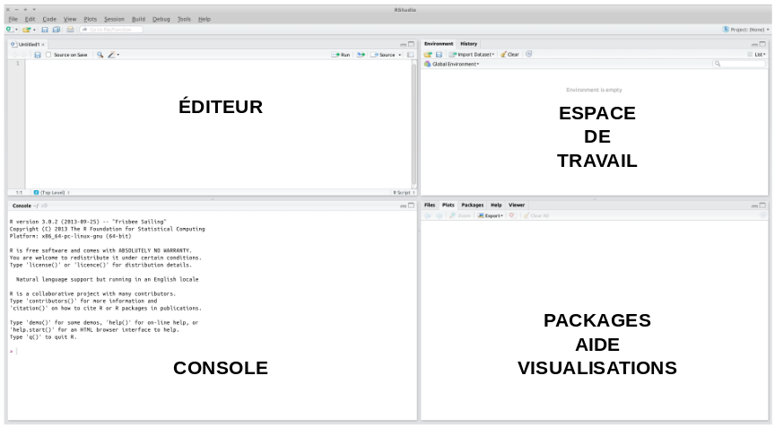
</p>


<br/>

**RStudio propose des fonctionnalités d'assistance :**

<ul>
<li>Une interface clic-bouton</li>            
**Plusieurs actions** comme la création et le chargement de programme, l'import de données, l'installation et le chargement de packages, l'accès à la documentation, la visualisation des objets, l'export de figures... **sont exécutables en un simple clic**.

<li>L’auto complétion</li>     
RStudio présente aussi la capacité de compléter automatiquement les termes en cours d’écriture.  **L’auto complétion  fonctionne  avec  la  touche Tab du  clavier**. Cela aide l'utilisateur.trice dans la saisie des noms d'objet, de fonction, de variable et des arguments de fonction.

<li>Des raccourcis clavier</li>    
RStudio propose de nombreux raccourcis clavier intéressants, exemple : 

- `Alt` + `-` renvoie l’opérateur d’assignation accompagné d’un espace avant et un espace après (<-)   
- `Ctrl` + `Entrée` exécute le code écrit dans la fenêtre d’édition (script)
- `Ctrl` + `shift` + `c` passe une ligne en commentaire 
- `shift`+`alt`+`k` pour accéder à l'ensemble des raccourcis. 


<br/>


### Les projets RStudio

Cette fonctionnalité permet d'organiser son travail en différents projets. L’idée principale est de réunir tous les fichiers relatifs à un même projet (quel que soit leur format) dans un répertoire dédié. **Le menu "Project" est accessible via une icône dédiée située tout en haut à droite** :

<br/>

<p class="center">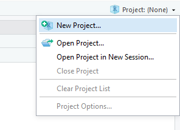
</p>

<br/>

Dans le menu **Project**, sélectionnez l’option **New project** :

<br/>

<p class="center">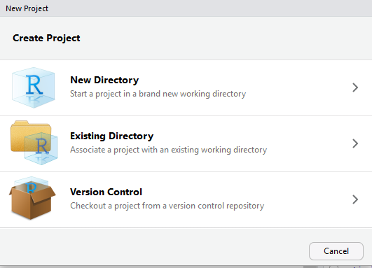
</p>

<br/>

Dans un nouveau répertoire, créez un projet vide. Indiquez le nom de votre projet, qui sera également le nom du répertoire créé pour stocker les données du projet. Puis, indiquez le répertoire parent, dans lequel votre projet sera créé :

<br/>

<p class="center">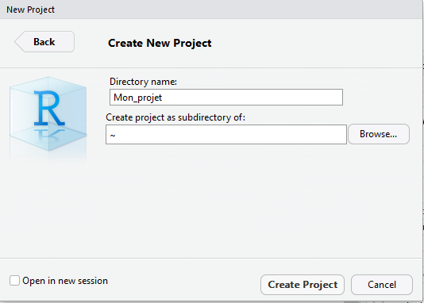
</p>

<br/>

**Utiliser les projets Rstudio permet également d'améliorer le partage et la mobilité de son travail**, car avec un projet Rstudio :

-> **Le répertoire de travail est prédéfini**, c'est celui du projet. Il n'est plus utile de paramétrer un répertoire courant. 

-> A chaque ouverture du projet, **on revient à l’état du projet tel qu’il était lors de la dernière utilisation**. Les scripts ouverts lors d’une précédente séance de travail sont automatiquement chargés.

-> Vous pouvez **utiliser facilement votre projet et vos scripts sur différentes machines** et/ou systèmes d'exploitation sans perdre d'information. 

-> Il est possible d'**utiliser des systèmes de gestion de version comme svn ou git**. Les systèmes de gestion de version permettent de gérer les différentes versions de scripts et facilitent le travail collaboratif. 

<br/>


# Les premiers pas

## Créer un objet R

R est un super calculateur. Si vous exécutez une opération, le résultat s'affiche dans la console :

```{r warning=FALSE, message=FALSE}

(10 + 2) * 5

```

**Mais le résultat n'est pas stocké**. Pour cela, **il est nécessaire d'assigner le résultat à un objet**. Les objets, au cœur de la programmation en langage R, permettent de stocker et de structurer les données.

Un objet peut être créé avec l'opérateur « assigner » (`<-`), une flèche composée du signe inférieur (`<`) accolé à un tiret (`-`).       
Si l'objet existe déjà, sa valeur précédente est remplacée par la nouvelle :    

```{r warning=FALSE, message=FALSE}

n <- "chaîne de caractères"

n

n <- 15 + 9

n

```

<br/>

## Les principaux objets

### Le vecteur

**Le vecteur est la structure de données de base dans R. Le vecteur permet de regrouper des éléments d'une même classe**, comme par exemple des éléments *numeric* (*real* ou *decimal*), *integer*, *string*, *logical* ou *complex*...      
**Pour créer un vecteur**, il faut utiliser la **fonction `c()`**. La longueur d'un vecteur correspond au nombre d'éléments qu'il contient.    


```{r warning=FALSE, message=FALSE }

# Regroupement d'éléments dans un vecteur :
# Exemple avec des nombres (integer) :
c(1,5,8,4,3,6,9,2,7)

# Pour assigner mon vecteur dans un objet :
# Exemple avec un vecteur de caractères
mon_vecteur <- c("A","B","C","D","E")
mon_vecteur 

# Il n'est pas possible de regrouper des éléments de classe différentes :
mon_vecteur <- c("nom", "prenom", 10, 20.78, TRUE)
# Ici, toutes les valeurs sont converties en chaîne de caratères :
mon_vecteur

# Ajouter un (ou plusieurs) élément(s) à un vecteur
mon_vecteur <- c(mon_vecteur, "Element+1", "Element+2")
mon_vecteur 

```

<br/>

### Le facteur

**Un facteur (factor) est un vecteur contenant uniquement certaines valeurs prédéfinies**. Les valeurs pré-définies sont appelées des **levels**. La manipulation de ce type d'objet peut être compliquée pour un.e débutant.e, mais il peut s’avérer très utile pour pratiquer l'analyse de réseau sur R.

```{r warning=FALSE, message=FALSE}

my_factor <- factor(sample(x = c("North", "East", "South", "West"), size = 13, replace = TRUE))
my_factor


# Comment se structure le facteur ?
str(my_factor)

# levels() permet d'obtenir la liste des modalités :
levels(my_factor)

# Nombre d'éléments par level
summary(my_factor)

# Elément 8
my_factor[8]

```
<br/>


### Le data.frame

**Un data.frame est utilisé pour stocker un tableau de données**. Il s'agit en fait d'un **ensemble de vecteurs de même longueur**.
Utilisez la fonction `data.frame()` pour construire un data.frame.

```{r warning=FALSE, message=FALSE}

# Construction de 3 vecteurs
personne <- c("John Doe","Peter Gynn","Jolie Hope","John snow")
salaire <- c(21000, 23400, 26800, 32700)
date <- c("2010-11-1","2008-3-25","2007-3-14", "1678-1-23")

# Construction d'un data.frame à partir de ces 3 vecteurs (de même longueur)
mon_tableau <- data.frame(personne, salaire, date)
mon_tableau

```

Pour **ajouter une colonne** à un data.frame :

```{r warning=FALSE, message=FALSE}

# Ajouter de colonne (variable) à mon tableau
# Une modalité unique
mon_tableau$Satut <- "employé"
mon_tableau

# Une modalité par ligne
mon_tableau$Sexe <- c("H","H","F","H")
mon_tableau

```

<br/>

### La matrice

Une matrice est un **tableau de nombre à double entrée**. Il est possible de créer une matrice avec la fonction `matrix()`. 

```{r warning=FALSE, message=FALSE}

# Création d'une matrice de 4 lignes et 4 colonnes
# stockant des valeurs allant de 1 a 16
ma_matrice <- matrix(1:16, nrow=4, ncol=4) 
ma_matrice

```

<br/>

### La liste

**Une liste permet de regrouper différents types d'objets dans un seul**. Il s'agit en quelque sorte d'**un vecteur d'objets**.
Il est possible de créer une liste avec la **fonction `list()`**.

```{r warning=FALSE, message=FALSE}

# Création de 4 objets différents
objet_simple <- "Nom de ma liste"
vector_A <- c("John Doe","Peter Gynn","Jolie Hope","John snow")
vector_B <- c(21000, 23400, 26800, 32700)
mon_tableau <- data.frame(vector_A, vector_B)

# Regroupement de ces 4 objets au sein d'une liste
ma_liste <- list(objet_simple , vector_A, vector_B, mon_tableau)
ma_liste

```


<br/>

### La fonction

Le logiciel R propose un ensemble de fonctions préprogrammées appelées fonctions primitives ou basiques et regroupées dans les packages de base (`base`, `graphics`...) qui sont automatiquement chargés à l'ouverture d'une nouvelle instance de R (ou RStudio).

```{r warning=FALSE, message=FALSE}

# Pour connaître toutes les fonctions primitives :
library(help = "base")


## Quelques exemples de fonctions primitives :

# library()       Charger une librarie
# class()         Connaître la classe de données d'un élément
# mean()          Calculer une moyenne
# read.csv()      Lire un fichier csv pour créer un data.frame

```

**Pour utiliser une fonction, il suffit d'écrire son nom, puis de spécifier des arguments entre parenthèses**. 

Dans la plupart des cas, les arguments d'une fonction sont prédéfinis. Il est donc important de **se renseigner sur les différents arguments d'une fonction et ses valeurs paramétrées par défaut**. Attention, certains arguments n'ont pas de valeur prédéfinie mais doivent obligatoirement être renseignés.

Exemple avec la fonction `mean()` :

```{r warning=FALSE, message=FALSE, eval=TRUE}

notes <- c(11,13,15,17,10,8,14,13,12,15,19,NA)

# Pour utiliser la fonction mean() sur le vecteur 'notes' :
mean(x = notes)

```
La fonction `mean()` retourne NA car la série statistique présente une valeur manquante.     
Il faut alors utiliser **l'argument na.rm (FALSE par défault) pour ne pas prendre en compte la valeur manquante** :

```{r warning=FALSE, message=FALSE, eval=TRUE}

# na.rm (= FALSE par défault) permet de prendre en compte ou non les valeurs NA
mean(x = notes, na.rm = TRUE)

# Pour stocker le résultat en mémoire (temporaire) :
moyenne <- mean(x = notes, na.rm = TRUE)

```

**Les fonctions** que l'on utilise sous R **sont des objets**. Tout le monde peut donc en créer. Pour cela, il est nécessaire d'utiliser la fonction `function()`. 

```{r warning=FALSE, message=FALSE}

nom_de_fonction <- function(arguments) { instructions }

```

**Pour utiliser une fonction issue d'un package spécifique (et non du r-base), vous devez d'abord installer le package puis charger la librairie** qui propose cette fonction :

```{r warning=FALSE, message=FALSE, eval=FALSE}

# Pour installer un package stocké sur le CRAN
# Indiquer le nom du package entre guillemets
install.packages("foreign")

# Chargement de la librarie
library(foreign)

# Il est maintenant possible d'utiliser une des fonctions proposées par le package foreign
# La fonction read.dbf() permet de lire des fichier de base de données dBASE
read.dbf("D:/users/geographie/Documents/nom_fichier.dbf")

```

<br/>

## Aide et documentation

Il y a plusieurs façons d'obtenir de l'aide avec R studio. **Vous pouvez utiliser l'onglet d'aide proposé par Rstudio** et accéder à la documentation d'une fonction :

<p class="center">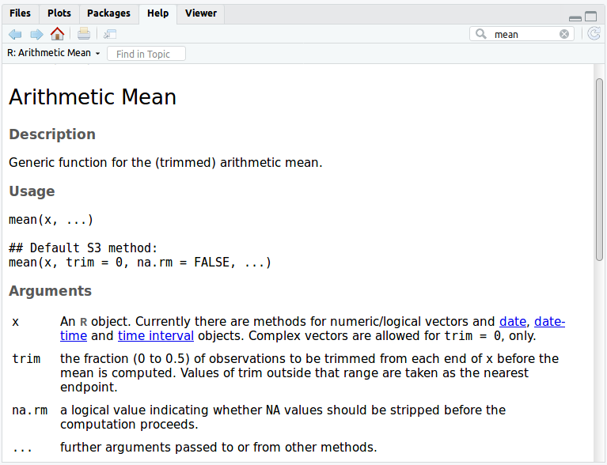
</p>

Il est possible d'**accéder à cette documentation par ligne de commande**, en utilisant le symbole `?` puis la fonction ciblée :

```{r warning=FALSE, message=FALSE,eval=FALSE}

# Exemple avec la fonction mean() :
?mean

```

**Ne négligez pas le service d’auto complétion proposé par RStudio**. C'est un véritable assistant de programmation. Il permet par exemple de s'assurer de l'orthographe d'un objet, d'une fonction ou de connaître les différents arguments possibles d'une fonction. Pour cela **il suffit d'utiliser la touche `tab` lors de la saisie**.

<p class="center">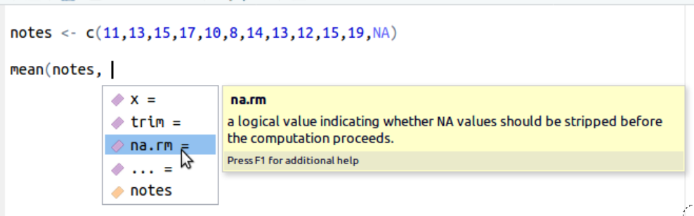
</p>

Enfin, **internet est une ressource documentaire très riche pour R**. Vous y trouverez toujours une réponse à vos questions, et presque toujours en français !

<br/>

## Importer ses données

On peut importer différents types de données sous R (tableau, image, couche géographique, sons...), mais nous nous intéressons ici uniquement aux tableaux de données. Il est possible d'**importer des tableaux de données directement en clic-bouton** depuis l'interface Rstudio :

<p class="center">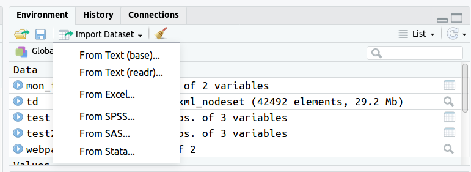
</p>

Pour des questions de reproductibilité des traitements, il est préférable d'importer ses données en ligne de commande. Pour cela, toute une série de fonctions (primitives ou non) peut être utilisée. Quelques exemples :

```{r warning=FALSE, message=FALSE, eval=FALSE}

## Fonctions primitives du r-base

read.table()  # Importer une table (format multiple)
read.delim()  # Importer une table (format multiple)
read.csv()    # Importer une table format csv

```

Il existe également de **nombreuses librairies pour importer des données stockées dans un format propriétaire**. Par exemple la librairie `xlsx` pour importer un fichier au format Excel.

Pour réaliser un import correct, **il est souvent nécessaire de renseigner un certain nombre d'arguments**.

```{r warning=FALSE, message=FALSE,eval=FALSE}

# Exemple d'import de fichier csv
# not run
My_data <- read.table(file = "/data/user/documents/DataFile.csv", 
                        header = TRUE, 
                        sep = ",", 
                        stringsAsFactors = FALSE, 
                        encoding = "UTF-8")

```

**header** : valeur logique qui indique si la première ligne du fichier importé contient les noms des variables. (TRUE par défaut)       
**sep** : indique le séparateur de champ du fichier (" " par défaut)     
**stringsAsFactor** : les données de type caractère sont transformées (par défaut) en facteur       
**Encoding** : indique l'encodage utilisé pour les chaînes de caractères.

<br/>

## Interroger un objet

**Vous pouvez consulter un objet créé depuis l'interface Rstudio** :

<p class="center">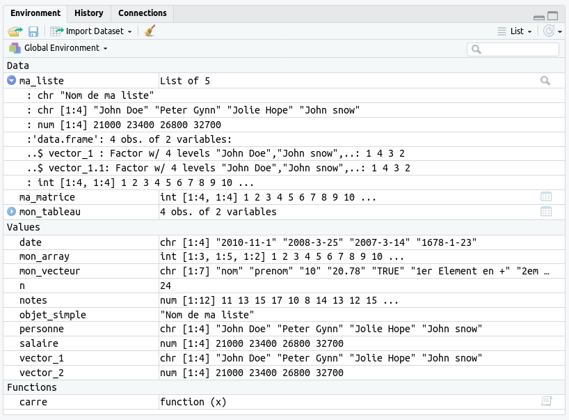
</p>

ou en ligne de commande :

```{r warning=FALSE,  message=FALSE}

# Structure interne ?
str(ma_liste)

```

**En cliquant sur l'objet, vous pouvez le visualiser dans sa globalité**. Pour cela, vous pouvez également utiliser la fonction `View()`.

```{r warning=FALSE,  message=FALSE, eval =FALSE}

View(mon_tableau)

```

<p class="center">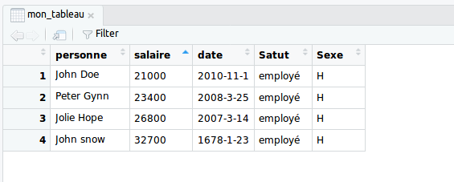
</p>

D'autres fonctions peuvent être utiles pour interroger un objet. Exemple :

```{r warning=FALSE,  message=FALSE}

# Pour connaître les dimensions d'un tableau
# Nb lignes et colonnes
dim(mon_tableau)

# Statistiques sur chaque variables :
summary(ma_matrice)

```

**Pour sélectionner/naviguer au sein d'un objet, utiliser les crochets `[]`**

```{r warning=FALSE,  message=FALSE}

# VECTOR - vecteur[index]
# Sélection du 3e élément
mon_vecteur[3]

# DATA.FRAME (OU MATRCE) - data.frame[ligne(s), colonne(s)]
# 2e et 3e ligne, 1er colonne
mon_tableau[c(2,3), 1]
# Autre technique pour 2e ligne, 1er colonne
mon_tableau$vector_A[2]

# LIST - list[[Index objet]][Index élémént]
# 2e objet de la liste
ma_liste[[2]]
# 1er élément du 2e objet
ma_liste[[2]][1]

```

Pour les tableaux (data.frame), vous pouvez également utiliser les noms des colonnes :

```{r warning=FALSE, message=FALSE}

# Première ligne de ma colonne "vector_A"
mon_tableau[1,"vector_A"]

# Equivaut à  :

# Première ligne de ma colonne "vector_A"
mon_tableau$vector_A[1]

```

<br/>


## Exercice

<div  class="Exercice">

**0) Lancez RStudio et créez un projet**

**Un jeu de données est mis à votre disposition**. Il porte sur les relations sexuelles entre les personnages de la série Grey's Anatomy. Il comporte deux fichiers : le premier contient **les sommets et leurs attributs (les personnages de la série)**, le second contient **les liens (arêtes) qui symbolisent les relations sexuelles** observées entre les personnages.   

**1) Télécharger les données** en cliquant [**ici**](https://gitlab.huma-num.fr/hpecout/analyse_de_reseau_avec_r_nice_2019/raw/master/data.zip?inline=false)               
*Source : Gary Weissman, [Grey’s Anatomy Network of Sexual Relations](https://gweissman.github.io/post/grey-s-anatomy-network-of-sexual-relations/){target="_blank"}, [https://gweissman.github.io](https://gweissman.github.io){target="_blank"} , 2011.*    

**2) Décompressez l'archive à la racine du répertoire de votre projet Rstudio**.

**3) Créer et sauvegarder un nouveau fichier r**

**3) Importer les deux fichiers téléchargés dans des objets R** à l'aide de la fonction de base **`read.table()`**, en écrivant le code nécessaire dans votre fichier r.

**4) Contrôlez vos deux objets créés** pour s'assurer que vous les avez correctement importés.

</div> 

```{r warning=FALSE, message=FALSE, eval=TRUE, include=FALSE}

# Import des liens (relation sexuelle)
sexual_rel <- read.table(file = "data/Greys_anatomy_Sexual_relation.csv", 
                         header = TRUE, 
                         sep = ",")

# Import des attributs des personnages
attributes <- read.table(file = "data/Greys_anatomy_Attributes.csv",
                         header = TRUE, 
                         sep = ",")

``` 
 


<br/>

# L'analyse de réseaux avec R

Plusieurs librairies permettent de faire de l'analyse de réseaux avec R (`network`, `tnet`, `statnet`, `sna`...) mais **la librairie la plus accessible pour démarrer l'analyse de réseaux avec R s'appelle `igraph`**.

## La librairie 'igraph'

**Le code source de cette librairie open source est écrit en langage C**. Elle a été développée par **Gábor Csárdi et Tamás Nepusz**. La première version de cette librairie est mise à disposition en 2006 (dernière version stabilisée en 2014). **Elle a été par la suite adaptée en librairie Python et R**.

*Les deux solutions pour installer igraph** avec RStudio. **En clic- bouton** :

<p class="center">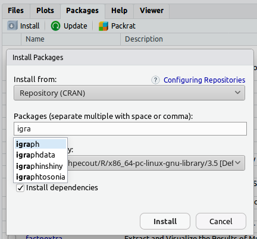
</p>


**En ligne de commande** :

```{r warning=FALSE, eval=FALSE, message=FALSE}

# Installation du package igraph
install.packages("igraph")

```

**Cette opération n'a pas besoin d'être reproduite à chaque nouvelle instance de R**, sauf si vous souhaitez mettre à jour le package. L'installation d'un package peut prendre un peu de temps. **Astuce : une icône stop est affichée en haut à droite de la console lorsque R est en train d'exécuter votre code** :

<p class="center">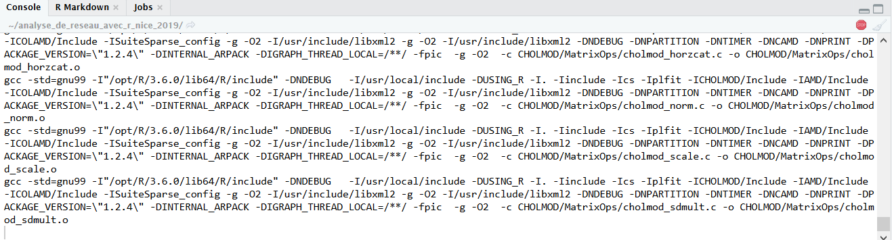
</p>

Pour savoir si le package a correctement été installé, regardez les messages d'alerte affichés dans la console : 

<p class="center">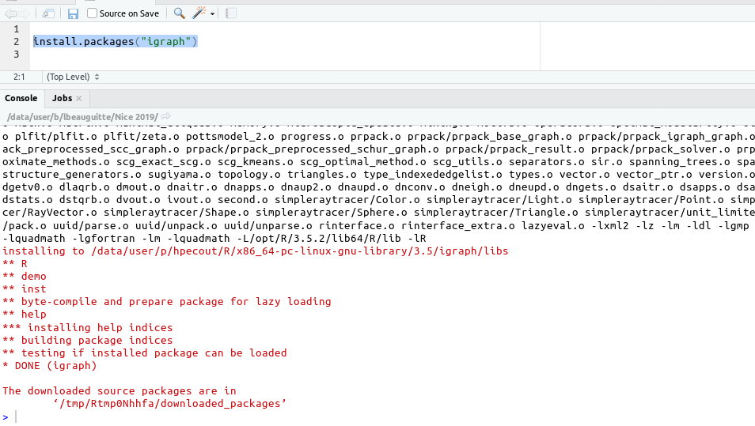
</p>

Les dernières lignes indiquent que le package a bien été installé (**DONE**).


**Avant de pouvoir utiliser une des fonctions du package `igraph`, il est nécessaire de charger la librairie**, et cela **à chaque nouvelle instance de R**. 

```{r warning=FALSE, eval=TRUE, message=FALSE}

# Chargement de la librairie igraph
library(igraph)

```

Pour accéder à la documentation, vous pouvez utiliser les deux lignes de commande suivantes :

```{r warning=FALSE, eval=FALSE, message=FALSE}

# Ouverture de l'onglet d'aide pour le package igraph
?igraph

# Métadonnées + liste des fonctions
library(help="igraph")

```

Mais **internet reste une ressource inégalée**. Vous trouverez toujours une conversation de forum, un pdf, un billet de blog... qui apportera les réponses à vos questions. **Voici deux ressources officielles pour la librairie `igraph`** :

- <a href="https://igraph.org/r/doc/igraph.pdf" target="_blank">Documentation officielle et complète du package igraph</a>
- <a href="https://igraph.org/r/" target="_blank">Site web de la librairie open source igraph</a>

## L'objet 'igraph'

**Une fonction va nous permette de construire un objet (list) appelé communément objet 'igraph', à partir des données relationnelles (liste de liens + éventuellement d'un tableau d'attributs décrivant les sommets du réseau)**.

 **A partir d'une liste de liens** (ici, relation sexuelle : Greys_anatomy_Sexual_relation.csv) :

```{r warning=FALSE, message=FALSE, eval=TRUE, include=TRUE, echo=FALSE}

library(DT)
datatable(sexual_rel, rownames = FALSE)

```

<br/>

**et éventuellement d'un tableau d'attributs des sommets** (ici, caractéristiques des personnages : Greys_anatomy_Attributes.csv) :

```{r warning=FALSE, message=FALSE, eval=TRUE, include=TRUE, echo=FALSE}

datatable(attributes, rownames = FALSE)

```

<br/>

**On construit un objet 'igraph' (list)**, à l'aide de la fonction `graph_from_data_frame()` :

```{r warning=FALSE, message=FALSE, eval=TRUE}

# CONSTRUCTION DE L'OBJET 'igraph'
library(igraph)

# Construction du réseau, seulement à partir de la liste de liens 
Mon_reseau_ex <- graph_from_data_frame(sexual_rel, directed = FALSE)

# Classe de l'objet crée ?
class(Mon_reseau_ex)

# Affichage de l'objet crée :
Mon_reseau_ex

summary(Mon_reseau_ex)


```


La description de votre objet igraph commence par 4 lettres :

**D ou U**, pour un **graphe orienté** (Directed) ou non (Undirected)    
**N** si il s'agit d'un **"Named graph"** : les sommets possèdent alors un attribut 'name'   
**W** Si le graphe est **pondéré** : les liens possèdent alors un attribut 'weight'   
**B** Si le graphe est **bipartite** : les sommets possèdent alors un attribut booléen 'type' permettant de différencier les deux ensembles de sommets.   
    
**Les deux chiffres qui suivent** (ici 44 et 46) **indiquent le nombre de sommets et de liens du graphe**.
La description de l'objet se poursuit avec la liste des attributs des sommets et des liens. La première lettre entre parenthèse (qui suit le nom de l'attribut) indique à quel élément du graphe se rattache l'attribut et la seconde indique la classe des valeur stockées (chaîne de caractère, nombre..). Exemple :

(g/c) - Graph / Character attribute    
(v/c) - Vertex / Character attribute   
(e/n) - Edge / Numeric attribute    


```{r warning=FALSE, message=FALSE, eval=TRUE}

# Construction du réseau, en ajoutant des attributs pour les sommets
Mon_reseau <- graph_from_data_frame(sexual_rel, 
                                    vertices = attributes, 
                                    directed = FALSE)

# Affichage de l'objet créé :
Mon_reseau

```

**Pour accéder aux informations de manière plus ciblée**, vous pouvez **utiliser la fonction `V()`** (V pour vertex), et **`E()`** (E pour edge).

```{r warning=FALSE, message=FALSE, eval=TRUE}

# Lister les sommets (vertex) de mon réseau
V(Mon_reseau)

# Lister les liens (edges) de mon réseau
E(Mon_reseau)

# Lister les valeurs de la variable 'name' (automatiquement créé)
V(Mon_reseau)$name

# Pour les valeurs de la variable 'weight'
# Mais il ne s'agit pas d'un graphe pondéré...
E(Mon_reseau)$weight

# Pour assigner une pondération aux liens, la synthaxe est la suivante :
# Pour l'exemple, on assigne une vecteur de 44 valeurs aléatoire entre 0 et 100
E(Mon_reseau)$weight <- sample(c(0:100), 46, replace = TRUE) 

# Lister tous les attributs (et valeurs) des sommets
vertex_attr(Mon_reseau)

# Lister tous les attributs (et valeurs) des liens
edge_attr(Mon_reseau)

```


Pour **extraire la liste des liens ou des sommets** de votre objet igraph  :

```{r warning=FALSE, message=FALSE, eval=TRUE}

# Liens en tableau :
lien_de_mon_reseau <- as_data_frame(Mon_reseau, what="edges")

# Sommets en tableau :
Sommet_de_mon_reseau <- as_data_frame(Mon_reseau, what="vertices")

# Matrice d'adjacence :
# Mon_reseau[]
Mat_mon_réseau <- Mon_reseau[attr="weight"]

```

<br/>


## Représentation graphique

Une fois vos données relationnelles transformées en objet igraph, **il est possible de les représenter graphiquement** avec la **fonction de r-base `plot()`**

```{r warning=FALSE, message=FALSE, eval=TRUE,echo=TRUE, fig.height=7}

# Affichage graphique de mon réseau
plot(Mon_reseau)

```

Toute **une série d'arguments permet d'ajuster la représentation** à sa guise.

**Pour paramétrer les sommets :**      
**vertex.color** : couleur (Ex : "red")        
**vertex.frame.color** : couleur des bordures (Ex : "white")        
**vertex.shape** : forme ("none", "circle", "square", "rectangle", "pie", "raster", "sphere"...) 
**vertex.size** : taille de la forme (15 par défaut)    
**vertex.size2** : seconde dimension (pour la forme rectangle par exemple)    
**vertex.label.color** : couleur des labels     
**vertex.label** : label (vecteur de chaîne de caractères)    
**vertex.label.family**	: famille de police des labels (ex : "Times", "Helvetica"...)        
**vertex.label.font** : police (1=plain, 2=bold, 3=italic, 4=bold italic...)    
**vertex.label.cex** : taille des labels    
**vertex.label.dist** : distance entre label et sommet    
**vertex.label.degree** :	position des labels par rapport aux sommets (0=right, pi=left, pi/2=below, -pi/2=above)    

**Pour paramétrer les liens :**        
**edge.color** : couleur (Ex : "red")     
**edge.width** : épaisseur   
**edge.arrow.size** : taille de la flèche (si orienté, 1 par défaut)      
**edge.arrow.width** : largeur de la flèche (si orienté, 1 par défaut)    
**edge.lty** : type de ligne (0=blank, 1=solid, =dashed, 3=dotted, 4=dotdash, 5=longdash, 6 = twodash)    
**edge.label** : label (vecteur de chaîne de caractères)     
**edge.label.family**	: famille de police des labels      
**edge.label.font** : police (1=plain, 2=bold, 3=italic, 4=bold italic...)    
**edge.label.cex** : taille des labels       
**edge.curved**	: courbure des liens (0=FALSE to 0.5=TRUE)   
**arrow.mode** :	préciser ou placer les flèches (0 = no arrow, 1 = back, 2 = forward, 3 = both) 	 
**Autres paramètres importants :**   
**margin** : marges autour du graphe (vecteur de quatre chiffres : c(bottom, left, top, right)). Ex : c(1,1,2,1))   
**frame** : encadrer le graphe ? TRUE ou FALSE    
**main** : titre du graphe   
**sub** : sous-titre du graphe       
**layout** : spatialisation du graphe. De nombreux  choix possibles :  layout_as_bipartite, layout_as_star, layout_as_tree, layout_in_circle, layout_nicely, layout_on_grid, layout_on_sphere...


**Vous pouvez utiliser n'importe quelle couleur dans R en indiquant son code hexadécimal**. Ex : "#4d4dbe"    
Vous pouvez également utiliser des couleurs directement implémentées dans R, en les appelant par leur nom. Ex : "violet"
**Pour connaître la liste des couleurs implémentées dans R, vous pouvez consulter ce** [document](http://www.stat.columbia.edu/~tzheng/files/Rcolor.pdf){target="_blank"}     

Exemple de mise en forme :

```{r warning=FALSE, message=FALSE, eval=TRUE,echo=TRUE, fig.height=8}

plot(Mon_reseau, 
     vertex.color = "darkolivegreen4", 
     vertex.frame.color = "white",
     vertex.shape = "sphere",
     vertex.size = 6,
     vertex.label.color = "grey20",
     vertex.label.font = 4,
     vertex.label.cex = 0.5, 
     vertex.label.dist = 1.6,
     vertex.label.degree = 0,
     edge.color = "goldenrod3", 
     edge.width = 3,
     edge.lty = 1,
     margin =  c(0,0,0.2,0),
     main = "Relations sexuelles entre les personnages de Grey's Anatomy (8 saisons)",
     sub = "Source : Gary Weissman, Greys Anatomy Network of Sexual Relations, https://gweissman.github.io, 2011",
     layout = layout_nicely)


```     


**L'argument 'layout' permet d'utiliser des algorithmes de placement** qui peuvent s'avérer utiles selon le type de réseau.    
Voici **quelques exemples de spatialisation disponibles** avec l'argument 'layout' :

```{r warning=FALSE, message=FALSE, eval=TRUE, echo=FALSE, include==TRUE, fig.height=8}

layouts <-grep("^layout_",ls("package:igraph"), value=TRUE)[-1]

# Suppression des spatialisations non adaptées à ce graphe
layouts <- layouts[!grepl("bipartite|merge|norm|sugiyama|tree", layouts)]

par(mfrow=c(5,3), mar=c(1,1,1,1))
for (layout in layouts) {
l <-do.call(layout,list(Mon_reseau))
plot(Mon_reseau, edge.arrow.mode=0, layout=l, main=layout, vertex.label=NA  ) 
}

```

<br/>

**Il est possible de prendre en compte les valeurs de certains attributs dans la représentation du graphique**.      
On peut par exemple **colorer ou modifier la forme des sommets en fonction des valeurs d'un attribut** :

```{r warning=FALSE, message=FALSE, eval=TRUE,echo=TRUE, fig.height=7}

# Pour modifier la forme des sommets en fonction de l'attribut 'sex' :
# Il suffit d'assigner une forme à la variable 'shape' en fonction de la valeur de la variable 'sex'
# Si 'sex' = F alors 'shape' = "circle", sinon 'shape' = "square"
V(Mon_reseau)$shape <- ifelse(V(Mon_reseau)$sex %in% "F", "circle", "square")


# Pareil pour la couleur des sommets : 'color' en fonction des valeurs de la variable 'race'
V(Mon_reseau)$color  <- ifelse(V(Mon_reseau)$position %in% "Chief", "red2", 
                                  ifelse(V(Mon_reseau)$position %in% "Resident","royalblue1",
                                        ifelse(V(Mon_reseau)$position %in% "Attending",  "mediumpurple1",
                                                ifelse(V(Mon_reseau)$position %in% "Nurse",  "coral2",
                                                      ifelse(V(Mon_reseau)$position %in% "Intern",  "darkgoldenrod1",
                                                             ifelse(V(Mon_reseau)$position %in% "Non-Staff", "olivedrab3","grey50"))))))


# Cela fonctionne pour d'autres paramètres (ex : label.color, size...) et également pour les liens.

```

**Si une variable contient beaucoup de modalités différentes, il est préférable d'utiliser la technique suivante**, qui utilise les fonctionnalités de l'**objet Factor** : 

```{r warning=FALSE, message=FALSE, eval=TRUE,echo=TRUE, fig.height=7}

# 1) Repèrez le nombre de modalités (levels()) et leur ordre de stockage une fois que 
# le vecteur de la variable 'position' est transformé en facteur (as.factor()) : 
levels(as.factor(V(Mon_reseau)$position))

# 2) Création d'un vecteur de couleur de la même longueur que le nombre de modalités :
# la première couleur sera assignée à la modalité 1, col 2 = Mod 2 ...
colrs <- c("mediumpurple1","red2","darkgoldenrod1","olivedrab3","coral2","grey50","royalblue1")
colrs

# Puis, il suffit d'une ligne de code pour assigner une couleur en fonction des modalités :
V(Mon_reseau)$color  <- colrs[as.factor(V(Mon_reseau)$position)]
V(Mon_reseau)$color

```


**Une fois que les couleurs, formes, tailles... sont prédéfinies pour les sommets et les arêtes, elles s'afficheront automatiquement** : 


```{r warning=FALSE, message=FALSE, eval=TRUE,echo=TRUE, fig.height=7}

plot(Mon_reseau, 
     vertex.size = 7,
     vertex.label= NA,
     edge.color = "black", 
     edge.width = 2,
     edge.lty = 1,
     margin =  c(0,0,0.2,0),
     main = "Représenter les attributs des sommets et des arêtes",
     layout = layout_nicely) 

```

**Dans ce cas, il peut être utile d'ajouter une légende**. Pour cela, **utilisez la fonction `legend()`**
Vous pouvez également **ajouter du texte avec la fonction `text()`**

```{r warning=FALSE, message=FALSE, eval=TRUE,echo=TRUE, fig.height=7}

plot(Mon_reseau, 
     vertex.size = 7,
     vertex.label= NA,
     edge.color = "black", 
     edge.width = 2,
     edge.lty = 1,
     margin =  c(0,0,0.2,0),
     main = "Représenter les attributs des sommets et des arêtes",
     layout = layout_nicely)


# Légende - variable sex
legend(x = -1.5,
       y = 1, 
       legend = levels(as.factor(V(Mon_reseau)$sex)), 
       pch = c(21, 22),
       pt.bg= NA, 
       pt.cex=2, 
       bty="o",
       title = "Sexe")

# Légende -  variable position
legend(x = 1,
       y = 1, 
       legend = levels(as.factor(V(Mon_reseau)$position)), 
       pch=18,
       col=colrs, 
       pt.cex=2, 
       bty="n")

# Ajout de texte
text(x = 0,
     y = -1.2, 
     labels = "Quel beau graphe")

```

**Par défaut, les sommets d'un objet igraph sont positionnés sur un repère orthonormé étendu de -1 à 1** sur l'axe des abscisses et des ordonnées. Vous connaissez maintenant **le secret pour bien positionner vos éléments d'habillage (légende, texte...) !**. 

```{r warning=FALSE, message=FALSE, eval=TRUE,echo=FALSE, fig.height=7}

plot(Mon_reseau, 
     vertex.size = 8,
     vertex.label= NA,
     edge.color = "black", 
     edge.width = 2,
     edge.lty = 1,
     margin =  c(0,0,0.2,0),
     main = "Repère orthonormé utilisé par défaut",
     layout = layout_nicely)

abline(v=0)
abline(h=0)
abline(v=1)
abline(h=1)
# abline(v=2)
# abline(h=2)
abline(v=-1)
abline(h=-1)
# abline(v=-2)
# abline(h=-2)

text(x = 0.1, y = 0.1, labels= "0", col="red", font=2, cex = 1.5)
text(x = 1.1, y = 0.1, labels= "1", col="red", font=2, cex = 1.5)
text(x = -1.1, y = 0.1, labels= "-1", col="red", font=2, cex = 1.5)

text(y = 0.1, x = 0.1, labels= "0", col="red", font=2, cex = 1.5)
text(y = 1.1, x = 0.1, labels= "1", col="red", font=2, cex = 1.5)
text(y = -1.1, x = 0.1, labels= "-1", col="red", font=2, cex = 1.5)


```

<br/>

# Les principaux indicateurs

## Nombre de sommets/arêtes

**Les fonctions `gorder()` et `gsize()`** permettent respectivement de calculer **le nombre de sommets (ordre) et d'arêtes (taille)** de votre graphe.  

```{r warning=FALSE, message=FALSE, eval=TRUE,echo=TRUE, fig.height=7}

# Nombre de sommets
gorder(Mon_reseau)

# Nombre d'arêtes
gsize(Mon_reseau)

```


<br/>

## Mesurer la densité

**La densité d’un graphe désigne le rapport entre le nombre de liens présents et le nombre de liens possibles**. Elle varie entre 0 (graphe vide, sans aucun lien) et 1 (graphe complet). **Vous pouvez utiliser la fonction `graph.density()`** pour calculer la densité de votre graphe :

```{r warning=FALSE, message=FALSE, eval=TRUE,echo=TRUE, fig.height=7}

# Mesurer la densité d'un graphe
graph.density(Mon_reseau)

```

L'argument **`loops` permet de considérer les liens d'un sommmet vers lui-même (boucle)**.


<br/>


## Nombre de composantes connexes

**Un graphe est dit connexe s'il existe au moins un chemin entre toutes les paires de sommets. Dans le cas contraire, le graphe est constitué de différentes composantes connexes.** Pour connaître le nombre de composantes connexes de votre graphe, vous pouvez utiliser la fonction `components()`.

```{r warning=FALSE, message=FALSE, eval=TRUE,echo=TRUE, fig.height=7}

# Composantes connexes d'un graphe
components(Mon_reseau)

```

**Cette fonction renvoie trois variables :**

**membership** : identifiant de la composante connexe d'appartenance     
**csize** : nombre de sommets des composantes connexes    
**no** : nombre de composantes connexes   

Il est possible d'**extraire toute les composantes connexes d'un réseau** pour créer plusieurs graphes.

```{r warning=FALSE, message=FALSE, eval=TRUE,echo=TRUE, fig.height=7}

Mes_reseaux <- decompose(Mon_reseau)

# Cela construit un objet List d'objet igraph :
Mes_reseaux

# Pour accéder à chaque objet igraph :
Mes_reseaux[[3]]

```


<br/>

## Mesurer le diamètre

**Le diamètre d'un graphe est le plus long des plus courts chemins du graphe**, il se calcule avec la fonction **`diameter()`**.

```{r warning=FALSE, message=FALSE, eval=TRUE,echo=TRUE, fig.height=7}

# Mesurer le diamètre d'un graphe
diameter(Mon_reseau)

```

Attention, **la fonction `diameter()` prend en compte par défaut le poids (weight) des arêtes**. N'oubliez pas de renseigner tous les arguments nécessaires pour être sûr de ce que la fonction `diameter()` renvoie (cette recommandation est valable pour toutes les fonctions de R et, plus généralement, tous les logiciels d'analyse et de visualisation de données).

```{r warning=FALSE, message=FALSE, eval=TRUE,echo=TRUE, fig.height=7}

# Mesurer le diamètre d'un graphe
diameter(Mon_reseau, directed = FALSE, weights = NULL)

```

**Si votre graphe possède plusieurs composantes connexes, la fonction `diameter()` renvoie le plus grand diamètre par défaut**. 

<br/>

## Mesurer la transitivité globale

**La transitivité d'un graphe mesure la proportion de triades fermées (clique de trois sommets)** dans un réseau. Ce coefficient **mesure à quel point le voisinage d'un sommet est connecté**. 

```{r warning=FALSE, message=FALSE, eval=TRUE ,echo=TRUE, fig.height=7}

transitivity(Mon_reseau, type = "global")

```

Il n'y a donc aucun triangle amoureux !

<br/>

## Extraction d'un sous-graphe

Il est parfois nécessaire de sélectionner une partie d'un graphe. Vous pouvez **extraire des sous-graphes de votre réseau à partir des valeurs d'un attribut des sommets ou des liens**, en utilisant la fonction **`induced_subgraph()`** et de la fonction r-base **`which()`**.

```{r warning=FALSE, message=FALSE, eval=TRUE,echo=TRUE}

# Sélection des personnages définis comme "praticien"
Mon_reseau_Attending <- induced_subgraph(Mon_reseau, 
                          v = which(V(Mon_reseau)$position == c("Attending")))

```

```{r warning=FALSE, message=FALSE, eval=TRUE,echo=TRUE, fig.height=7}

# Représentation graphique
plot(Mon_reseau_Attending, 
     vertex.shape = "sphere",
     vertex.size = 8,
     vertex.label.font = 4,
     vertex.label.cex = 0.6, 
     vertex.label.dist = 2.3,
     vertex.label.degree = 0,
     edge.color = "black", 
     edge.width = 2,
     edge.lty = 1,
     margin =  c(0,0,0.2,0),
     main = "Relations sexuelles entre les 'praticien.ne.s' du service hospitalier")  


```

Pour **extraire un sous graphe en fonction des attributs des liens**, utilisez la **fonction `subgraph.edges()`**.

```{r warning=FALSE, message=FALSE, eval=TRUE,echo=TRUE}

# Sélection des liens d'intensité supérieure ou égale à 50
Mon_reseau_lien_select <- subgraph.edges(Mon_reseau, 
                          eids = which(E(Mon_reseau)$weight >= 50))

```

<br/>
 
# Mesures locales et globales


## Centralité des sommets

La centralité d’un sommet peut être calculée de plusieurs manières afin de répondre à des logiques différentes de centralité : 

 - Centralité de degré :       
 
**Nombre de voisins d'ordre 1 (nombre de liens entrants ou sortants, ou les deux)**
 
```{r warning=FALSE, message=FALSE, eval=TRUE,echo=TRUE}

# Centralité de degré
degree(Mon_reseau)

```

Pour **calculer la centralité de degré normalisée (degré / nombre de sommet-1)**, utilisez l'argument **`normalized`**
Si vous travaillez sur un graphe orienté, **l'argument `mode` permet de calculer le degré entrant, sortant ou les deux.**

```{r warning=FALSE, message=FALSE, eval=TRUE,echo=TRUE}

# Centralité de degré normalisée
degree(Mon_reseau, normalized = TRUE, mode = "in" )

```

<br/>

 - Centralité d'intermédiarité :       
 
**Proportion de plus courts chemins passant par un sommet donné**

```{r warning=FALSE, message=FALSE, eval=TRUE,echo=TRUE}

# Centralité d'intermédiarité
betweenness(Mon_reseau)

```


**Attention, par défaut, le calcul de la centralité d'intermédiarité n'est pas normalisé et utilise le poids des arêtes**.
**Utiliser les arguments `weights` et `normalized`** pour être sûr.e de ce que vous calculez.

**Les calculs des centralités d'intermédiarité et de proximité sont également faussés si votre graphe contient plusieurs composantes connexes**.
**Calculez ces centralités sur chaque composantes**

```{r warning=FALSE, message=FALSE, eval=TRUE,echo=TRUE}

# Centralité d'intermédiarité de la composante connexe 1
betweenness(Mes_reseaux[[1]], weights = NULL, normalized=TRUE, directed = FALSE)

```

<br/>

 - Centralité de proximité :    
 
**Inverse de la distance moyenne des plus courts chemins d'un sommet vers tous les autres**. Valeur entre 0 et 1.  

```{r warning=FALSE, message=FALSE, eval=TRUE,echo=TRUE}

# Centralité de proximité
closeness(Mes_reseaux[[1]], weights = NULL, normalized=TRUE, mode = "all")

```

 <br/>

### Mesures de centralité pour un sommet précis 


```{r warning=FALSE, message=FALSE, eval=TRUE,echo=TRUE}

# Mesure de centralité du premier sommet de mon réseau :
degree(Mon_reseau)[1]

# Pour utiliser directement le nom du sommet :
betweenness(Mon_reseau, weights=NULL, normalized=TRUE)["addison"]

# Sélection multiple (ex : sommets 1,5 et 7) :
closeness(Mon_reseau, weights=NULL, normalized=TRUE)[c(1,5,7)]

```

<br/>
 
### Les mesures de centralité comme attributs des sommets 

```{r warning=FALSE, message=FALSE, eval=TRUE,echo=TRUE}

# Les valeurs des centralités de degré sont insérées dans la variable 'degre'
V(Mon_reseau)$degre <- degree(Mon_reseau)

# Centralité d'intermediarité dans la variable 'intermed'
V(Mon_reseau)$intermed <- betweenness(Mon_reseau, weights=NULL, normalized=TRUE)
  
# Centralité de proximité dans la variable 'proximit'
V(Mon_reseau)$proximit <- closeness(Mon_reseau, weights=NULL, normalized=TRUE)
  
  
```

**Trois attributs comportant les mesures de centralités ont été ajoutés aux sommets :**

```{r warning=FALSE, message=FALSE, eval=TRUE, include=TRUE, echo=FALSE}

datatable(as_data_frame(Mon_reseau, what="vertices"))
  
```

<br/>
 
### Représentation graphique

Une fois **les valeurs des centralités stockées comme attribut des sommets, il est possible de les représenter graphiquement**.


```{r warning=FALSE, message=FALSE, eval=TRUE ,echo=TRUE, fig.height=7}

# Pour que la taille des sommets soit proportionnelle à une valeur :
# Par exemple, au degré des sommets :
# Il suffit de stocker le degré dans la variable 'size'
V(Mon_reseau)$size  <- V(Mon_reseau)$degre*2


# Les couleurs prédéfinies s'afficheront automatiquement
plot(Mon_reseau, 
     vertex.shape = "sphere",
     vertex.label = NA ,
     edge.color = "black", 
     edge.lty = 1,
     main = "Taille des sommets proportionnelle au degré")  


```

<br/>

## Distribution des degrés

**Observer la distribution des degrés**, permet de caractériser un graphe.   
**La fonction `degree.distribution()` permet de calculer pour chaque degré, la part (%) de sommets concernés**. La première valeur correspond à la fréquence relative (%) des sommets de degré 0, la seconde à la part des sommets de degré 1... jusqu'au degré maximum du graphe (9 dans notre cas). 


```{r warning=FALSE, message=FALSE, eval=TRUE,echo=TRUE}

degree.distribution(Mon_reseau)

# Les arguments importants :
# mode = c("all", "out", "in", "total")
# loops = TRUE/FALSE
# cumulative = TURE/FALSE)

```

**Il n'y a donc aucun sommet isolé dans notre graphe**, car aucun sommet ne présente un degré égal à 0.

**Représenter la distribution des degrés** aide également à l'interprétation car elle peut renseigner sur la structure du réseau :

```{r warning=FALSE, message=FALSE, eval=TRUE,echo=TRUE, fig.height=5}

plot(degree.distribution(Mon_reseau))

```


<br/>

## Tests de corrélation 

**Pour tester la corrélation entre deux indicateurs de centralité**, utilisez la fonction **`plot()` pour la représenter et `cor.test()` pour la mesurer**.


```{r warning=FALSE, message=FALSE, eval=TRUE,echo=TRUE, fig.height=7}

# Pour plus de lisibilité :
# On crée deux nouveaux objets correspondant à deux centralités
deg <- V(Mon_reseau)$degre
bet <- V(Mon_reseau)$intermed

# Représentation graphique
plot(x = deg, y = bet)
# Pour ajouter une droite de régression. 'abline()' + 'lm()' :
abline(lm(bet ~ deg), col="red")

# Test de corrélation 
# Méthode Pearson par défault
cor.test(deg, bet)


```

**La fonction renvoie 4 valeurs permettant de rejeter ou valider l'existence d'une corrélation entre les deux variables** :  
**t** : valeur de la statistique   
**df** : degré de liberté     
**p-value** : p-value    
**cor** : coefficient de corrélation (de Pearson dans ce cas).

<br/>

## Transitivité locale et globale

La fonction `transitivity()` renvoie par défaut la transitivité globale (pour l'ensemble du graphe). Mais **il est possible de calculer la transitivité locale (par sommet) en le précisant avec l'argument 'type'** :

```{r warning=FALSE, message=FALSE, eval=TRUE,echo=TRUE, fig.height=7}

# transitivity(Mon_reseau) = transitivity(Mon_reseau, type = c("global"))
# Pour calculer la transivitité locale :
transitivity(Mon_reseau, type = c("local"))

```

**Il n'est pas possible de calculer la transitivité pour les sommets qui ne sont pas liés à plus d'un autre sommet**. La fonction `transitivity()` renvoie alors la valeur 'NaN' (Not a Number).

<br/>


## Extraire les ego-networks

**La fonction `make_ego_graph()` permet d'extraire tous les ego-networks d'un réseau**.

```{r warning=FALSE, message=FALSE, eval=TRUE,echo=TRUE, fig.height=7}

# Extraction des ego-networks
# Comme avec la fonction decompose(), cette fonction construit une liste d'objets igraph :
EgoNet_Mon_reseau <- make_ego_graph(Mon_reseau)

# Une série d'argument permet pour choisir les paramètres des ego-network :
EgoNet_Mon_reseau <- make_ego_graph(Mon_reseau,
                                    nodes = V(Mon_reseau),
                                    order = 2,
                                    mode = c("all"),
                                    mindist = 0)


# Pour sélectionner les ego-network, utilisez des [[]] et l'identifiant des ego-networks
# V(Mon_reseau)$name[22]
EgoNet_Mon_reseau[[22]]

EgoNet_Karev <- EgoNet_Mon_reseau[[22]]

# Représentation d'un des ego-networks :
plot(EgoNet_Karev,
     vertex.shape = "sphere",
     vertex.label.color = "grey25",
     vertex.label.font = 1,
     vertex.label.cex = 0.6, 
     vertex.label.dist = 2,
     vertex.label.degree = 0,
     edge.color = "black", 
     edge.width = 2,
     edge.lty = 1,
     margin =  c(0,0,0.2,0),
     main = "Ego-network de Karev") 


```

Avant de poursuivre l'analyse de votre ego-network, **vous pouvez supprimer ego de votre réseau** :

```{r warning=FALSE, message=FALSE, eval=TRUE,echo=TRUE, fig.height=7}

# Suppression d'ego
EgoNet_Karev_sans_karev <- induced_subgraph(EgoNet_Karev, 
                                    v = which(V(EgoNet_Karev)$name != c("karev")))

# Représentation de l'ego-network, sans ego :
plot(EgoNet_Karev_sans_karev,
     vertex.shape = "sphere",
     vertex.label.color = "grey25",
     vertex.label.font = 1,
     vertex.label.cex = 0.6, 
     vertex.label.dist = 2,
     vertex.label.degree = 0,
     edge.color = "black", 
     edge.width = 2,
     edge.lty = 1,
     margin =  c(0,0,0.2,0),
     main = "Ego-network de Torres, sans Torres") 

```

<br/>

## Détection des communautés

**Pour détecter les communautés, 8 fonctions sont implémentées dans igraph**. La fonction **`cluster_edge_betweenness()` permet par exemple de créer une partition des sommets** par déconnexion progressive du graphe, en supprimant les arêtes dans l’ordre décroissant de leur centralité d'intermédiarité.
  
```{r warning=FALSE, message=FALSE, eval=TRUE,echo=TRUE, fig.height=7}

# Clustering
Clus_Edge_betweness <- cluster_edge_betweenness(Mon_reseau, weights=NULL)

# Affichage du résultat
plot(Clus_Edge_betweness, Mon_reseau, vertex.label=NA)

```

L'objet renvoyé est appelé objet **'communities' et contient les éléments suivants** :

```{r warning=FALSE, message=FALSE, eval=TRUE,echo=TRUE, fig.height=7}

names(Clus_Edge_betweness)

```

Pour **consulter ces différentes informations, utilisez le symbol `$`** :

```{r warning=FALSE, message=FALSE, eval=TRUE,echo=TRUE, fig.height=7}

Clus_Edge_betweness$membership

```

Il est possible d'**enregistrer la position des sommets** (placement dans la figure) afin qu'ils soient **toujours placés au même endroit** dans différentes figures :

```{r warning=FALSE, message=FALSE, eval=TRUE,echo=TRUE, fig.height=7}

# Enregistrement d'une position
mise_en_page <- layout.fruchterman.reingold(Mon_reseau)

# Pour réutiliser ces positions, utilisez l'argument 'layout':
plot(Clus_Edge_betweness, Mon_reseau, vertex.label=NA, layout = mise_en_page)

```


**Les autres fonctions de classification implémentées dans igraph sont les suivantes** :

**cluster_fast_greedy()** : greedy optimization of modularity    
**cluster_walktrap()** : short random walks    
**cluster_spinglass()** : based on statistical mechanics    
**cluster_leading_eigen()** : based on the leading eigenvector of the community matrix    
**cluster_label_prop()** : based on propagating labels   
**cluster_infomap()** : minimizes the length of a random walker    
**cluster_optimal()** : maximizing the modularity measure    

Un algorithme de partition d'un graphe se choisit en fonction de la taille du graphe, certains algorithmes étant inadaptés aux grands graphes. Il est conseillé de tester plusieurs algorithmes pour contrôler la stabilité des communautés détectées. Les résultats sont d'ailleurs parfois très différents. 

Il existe énormément d'algorithmes de détection de communautés, parfois très complexes. **Dans [**ce billet de blog**](https://arshs.hypotheses.org/1314), sont expliquées les différentes méthodes de partitionnement proposées par le package igraph**.

```{r warning=FALSE, message=FALSE, eval=TRUE, include=TRUE, echo=FALSE, fig.height=7}

Part_2 <- cluster_fast_greedy(Mon_reseau,weights=NULL)
Part_3 <- cluster_walktrap(Mon_reseau,weights=NULL)
# Part_4 <- cluster_spinglass(Mon_reseau)
Part_5 <- cluster_leading_eigen(Mon_reseau,weights=NULL)
Part_6 <- cluster_label_prop(Mon_reseau,weights=NULL)
Part_7 <- cluster_infomap(Mon_reseau)
# Part_8 <- cluster_optimal(Mon_reseau)

#Coreness ?
par(mfrow=c(2,3))

plot(Clus_Edge_betweness, Mon_reseau, vertex.label=NA, layout = mise_en_page,
  main = "cluster_edge_betweenness")
text(0,1.5, paste0("Modularité : ", round(modularity(Clus_Edge_betweness),2)))

plot(Part_2, Mon_reseau, vertex.label=NA, layout = mise_en_page,
  main = "cluster_fast_greedy")
text(0,1.5, paste0("Modularité : ", round(modularity(Part_2),2)))

plot(Part_3, Mon_reseau, vertex.label=NA, layout = mise_en_page,
  main = "cluster_walktrap")
text(0,1.5, paste0("Modularité : ", round(modularity(Part_3),2)))

# plot(Part_4, Mon_reseau)

plot(Part_5, Mon_reseau, vertex.label=NA, layout = mise_en_page,
  main = "cluster_leading_eigen")
text(0,1.5, paste0("Modularité : ", round(modularity(Part_5),2)))


plot(Part_6, Mon_reseau, vertex.label=NA, layout = mise_en_page,
  main = "cluster_label_prop")
text(0,1.5, paste0("Modularité : ", round(modularity(Part_6),2)))

plot(Part_7, Mon_reseau, vertex.label=NA, layout = mise_en_page,
  main = "cluster_infomap")
text(0,1.5, paste0("Modularité : ", round(modularity(Part_7),2)))


```

<br/>

## Exercice

**Pour démarrer cet exercice, exécutez le code ci-dessous**. Il génère **une liste de liens et des attributs**.     
**Vous pouvez choisir le nombre de sommets souhaités** en modifiant la valeur de l'objet **`Nb_sommets`** :

```{r warning=FALSE, message=FALSE, eval=TRUE, include=TRUE, echo=TRUE, fig.height=7}

# Indiquez le nombre de sommets souhaités :

Nb_sommets <- 25

# Exécuter le code ci-dessous pour génerer :
# - une liste de lien (tableau from-to)
# - un tableau d'attribut décrivant les sommets

# Si vous souhaitez verrouiller les tirages aléatoires,
# Utilisez la fonction set.seed() :
# set.seed(131)
# Le graphe généré sera alors toujours le même !

##########################################################
vec2 <- NULL
for (i in 1:c(Nb_sommets*2)){vec <- paste0(sample(LETTERS[2:26], 1, TRUE),sample(LETTERS[c(1,5,9,15,21,25)], 1, TRUE),sample(LETTERS[2:26], 1, TRUE))
vec2 <- c(vec2,vec)}
Sommet <- sample(unique(vec2),Nb_sommets, replace=FALSE)
from <- sort(rep(Sommet, sort(sample(c(1,2,3,4,0), size=Nb_sommets, prob = dlnorm(1:5, sdlog = 1, log = FALSE), replace=TRUE))))
to <- sort(rep(Sommet, sort(sample(c(1,2,3,4,0), size=Nb_sommets, prob = dlnorm(1:5, sdlog = 1, log = FALSE), replace=TRUE))))
m <- min(c(length(from),length(to)))
lien <- as.data.frame(cbind(from = from[sample(1:m, replace=F)], to = to[sample(1:m, replace=F)]))
lien$from <- as.vector(lien$from)
lien$to <- as.vector(lien$to)
for (l in 1:round(Nb_sommets/6,0)){smt <- lien[rownames(lien[lien$from == lien[l,"to"],]), "to"];lien <- rbind(lien,c(lien[l,"from"],smt[1]))}
lien <- lien[lien$from!=lien$to,]
mes_liens <- unique(lien)
mes_liens$value <- sample(1:7, nrow(mes_liens), prob = dlnorm(1:7, sdlog = 2, log = FALSE), replace = TRUE)
mes_sommets <- data.frame(name = Sommet, sexe = sample(x = c("Femme", "homme"), prob=c(5.5,4.5), size = Nb_sommets, replace = TRUE),
                          age = sample(x = c(18:60), prob=sample(1:5,43,replace=TRUE), size = Nb_sommets, replace = TRUE), 
                          salaire = sample(seq(from=1530,to=5130,length.out=Nb_sommets), 
                                           prob=dlnorm(1:Nb_sommets, sdlog = 3, log = FALSE)))
mes_liens <- mes_liens[!is.na(mes_liens$from),]
rm(list=setdiff(ls(), c("mes_sommets","mes_liens")))
##########################################################
##########################################################
```

**Les deux objets créés par ce bout de code sont :**

- un **dataframe contenant une liste de liens valués** :

```{r warning=FALSE, message=FALSE, eval=TRUE, include=TRUE, echo=true, fig.height=7}

# La fonction head() permet d'afficher les premières lignes d'un dataframe
head(mes_liens,10)

```

- un **dataframe contenant la liste des sommets et trois attributs ** :

```{r warning=FALSE, message=FALSE, eval=TRUE, include=TRUE, echo=TRUE, fig.height=7}

head(mes_sommets,10)

```

**A chaque exécution du code, un jeu de données de réseau aléatoire (orienté et valué) est généré**. Exemple :

<p class="center">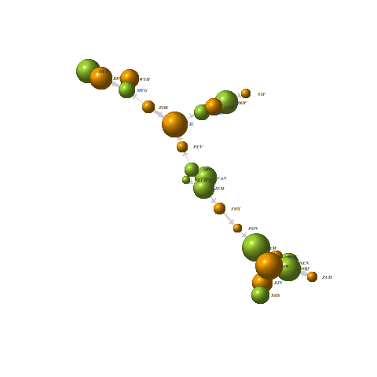
</p>


<div  class="Exercice">

**A partir des deux objets générés par le code ci dessus, vous devez :**

**1) Formalisez votre réseau en objet 'igraph' orienté et valué**

**2) Affichez votre graphe** en utilisant les différentes variables visuelles (couleur, forme, taille...) pour **représenter les différents attributs des sommets et des arêtes**.

**3) Calculez les principaux indicateurs globaux**     
Quelle est la densité de votre graphe ? Est-il connexe ? Combien comporte-t-il de composantes connexes ?     
Quel en est le diamètre, sa transitivité ?...

**3) Extrayez un sous graphe en fonction de deux attributs**    
ex : Sous-graphe des femmes de plus de 30 ans    
Puis, **gardez uniquement les liens de valeur supérieure à 1**   

**3) Calculez les différents indicateurs de centralité sur le graphe complet**   
Attention, il s'agit d'un graphe orienté ! **Visualisez la distribution des degrés**   

**4) Détecter des communautés en utilisant une fonction de partitionnement**   
**Affichez le résultat**. Puis, **comparez différents résultats de partitionnement**   

**5) Générez un nouveau jeu de données**, puis **ré-exécutez l'ensemble du code que vous venez d'écrire**          
L'exécution de votre programme se déroule-t-elle correctement ? Si non, trouvez pourquoi !   


</div> 

<br/>

# Sources & références


Il existe de **nombreuses ressources documentaires sur R**. En voici quelques-unes **en libre accès** et principalement portées sur l'analyse de réseau. Plusieurs d'entre elles ont été utilisées pour produire ce document.

<ul class="bibli">


<li><a href="https://cran.r-project.org/doc/contrib/Paradis-rdebuts_fr.pdf" onclick="window.open(this.href); return false;">*R pour les débutants*</a>, Emmanuel Paradis</li> 

<li><a href="https://cel.archives-ouvertes.fr/cel-00687871/document" onclick="window.open(this.href); return false;">*Analyser les réseaux avec R (packages statnet, igraph ettnet)*</a>, Laurent Beauguitte</li> 

<li><a href="https://hal.archives-ouvertes.fr/hal-01885485/document" onclick="window.open(this.href); return false;">*L’analyse de graphes avec R : un aperçu avec igraph*</a>, Sébastien Plutniak</li> 

<li><a href="http://statmath.wu.ac.at/research/friday/resources_WS0708_SS08/igraph.pdf" onclick="window.open(this.href); return false;">*Practical statistical network analysis (with R and igraph)*</a>, Gabor Csardi</li> 

<li><a href="https://kateto.net/netscix2016.html" onclick="window.open(this.href); return false;">*Network Analysis and Visualization with R and igraph*</a>, Katherine Ognyanova</li> 

<li><a href="https://f.hypotheses.org/wp-content/blogs.dir/2996/files/2017/02/visualiseR.pdf" onclick="window.open(this.href); return false;">*Visualisation de réseaux avec R*</a>, Katherine Ognyanova</li> 

<li><a href="https://www.jessesadler.com/post/network-analysis-with-r/" onclick="window.open(this.href); return false;">*Introduction to Network Analysis with R*</a>, Jesse Sadle</li> 

<li><a href="http://sachaepskamp.com/files/Cookbook.html" onclick="window.open(this.href); return false;">*Network Analysis in R Cookbook*</a>, Sacha Epskamp</li> 

<li><a href="https://f.briatte.org/r/awesome-network-analysis-list" onclick="window.open(this.href); return false;">*An awesome list of network analysis resources*</a>, François Briatte</li>


</ul>


<br>


# -- R Session info -- 


```{r, eval=T, echo=T}
R.version
```


```{r, eval=T, echo=T}
sessionInfo()
```

<br>

<p style="text-align:center;color:grey;font-style:italic;font-size:12px;padding:0;margin-top:15px;">Ce document est mis à disposition selon les termes de la **Licence Creative Commons** : <br>
<a href="https://creativecommons.org/licenses/by-nc-sa/4.0/" onclick="window.open(this.href); return false;">Attribution-NonCommercial-ShareAlike 4.0 International (CC BY-NC-SA 4.0)</a></p>